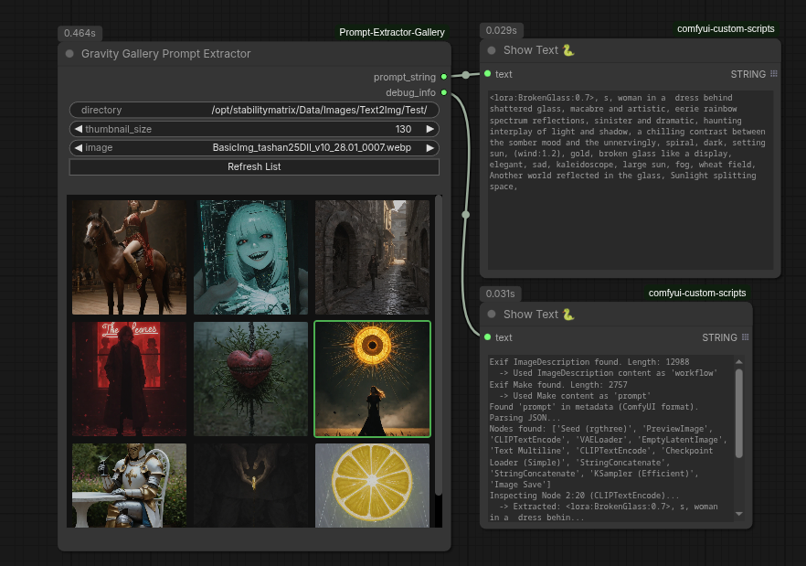

# ComfyUI-Prompt-Extractor-Gallery
Lets you browse images in a folder, select one, then it will attempt to extract the prompt used to generate that image from the image metadata and output it as a string.

### Gravity Gallery Prompt Extractor Node Walkthrough
The Gravity Gallery Node is a custom ComfyUI node that allows you to browse images from a local directory, view them in a grid, and extract their prompts/workflows for use in your current graph.

### Features
* **Visual Gallery**: Displays a scrollable grid of images from your chosen directory directly on the node.
* **Prompt Extraction**: Intelligently extracts prompts from:
  * PNG images (ComfyUI prompt/workflow and Automatic1111 parameters).
  * WebP images (Exif UserComment, Make, ImageDescription).
* **Linked Node Support**: Recursively traces text inputs in ComfyUI workflows (e.g., following links into Primitive nodes) to find the actual prompt text.
* **Dynamic Layout**: Adjustable thumbnail size and grid columns that scale with the ComfyUI canvas zoom.

### Usage
* **Add Node**: Search for "Gravity Gallery" in the ComfyUI node menu.
* **Set Directory**: Enter the absolute path to your image folder in the directory widget.
* **Refresh: Click** "Refresh List" to load the images.
* **Browse**:
  * Use the thumbnail_size slider to adjust the grid view.
  * Scroll through the gallery.
  * Click an image to select it.
* **Connect**:
  * Connect prompt_string to a CLIP Text Encode or checking node to use the extracted prompt.
